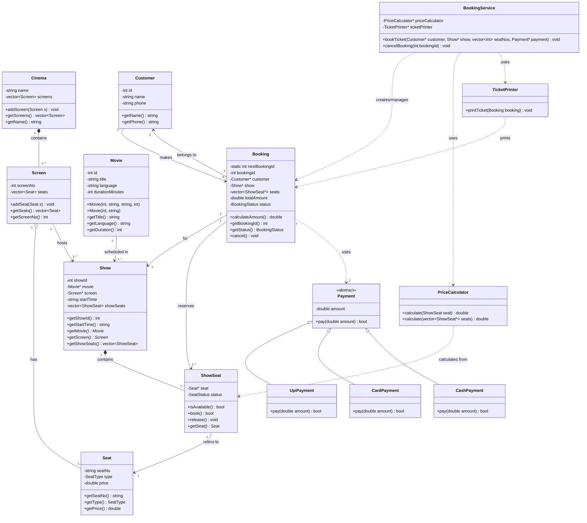

# Class Diagram

## Movie Ticket Booking System

This diagram shows the main classes, their responsibilities, relationships, multiplicities, and the payment hierarchy used in the system.

## Relationship Legend

| Symbol | Meaning |
|---|---|
| `*--` | Composition — strong ownership/lifecycle relationship |
| `o--` | Aggregation — weak ownership relationship |
| `-->` | Association / directed relationship |
| `..>` | Dependency / uses relationship |
| `<|--` | Inheritance / generalization |
| `1..*` | One-to-many multiplicity |
| `0..*` | Zero-to-many multiplicity |

## OOP Concepts Visible in the Design

- **Encapsulation:** class data members are private and accessed through public methods.
- **Abstraction:** `Payment` is an abstract base class.
- **Inheritance:** `UpiPayment`, `CardPayment`, and `CashPayment` inherit from `Payment`.
- **Runtime polymorphism:** `pay()` is overridden by the payment subclasses.
- **Compile-time polymorphism:** overloaded `Movie` constructors and `PriceCalculator::calculate()` methods.
- **Static member:** `Booking::nextBookingId` generates unique booking IDs.
- **Composition:** `Cinema` contains `Screen` objects and `Show` contains `ShowSeat` objects.
- **Aggregation:** `Screen` aggregates `Seat` objects.
- **Association:** `Customer`, `Booking`, `Movie`, and `Show` are connected through their relationships.
- **`this` pointer:** used by class methods/constructors where the current object is referenced.
