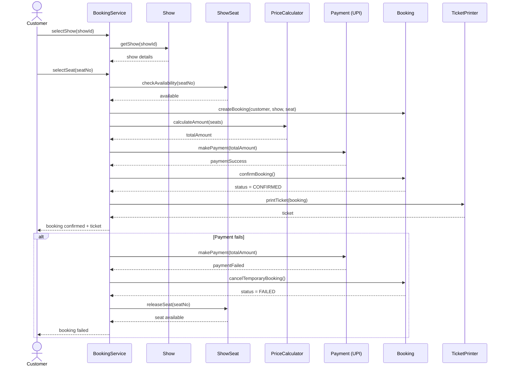

# Sequence Diagram

## Use Case: Customer books one seat and pays by UPI

The sequence below represents the normal booking flow followed by the payment-failure recovery flow.

## Main Flow

1. Customer selects a show.
2. The booking service obtains the show details.
3. Customer selects a seat.
4. The selected `ShowSeat` is checked for availability.
5. A temporary booking is created.
6. `PriceCalculator` calculates the total amount.
7. The selected payment implementation processes the payment.
8. After successful payment, the booking becomes **CONFIRMED**.
9. `TicketPrinter` generates the ticket and it is returned to the customer.

## Alternate Flow — Payment Failure

If payment fails, the temporary booking is marked **FAILED** and the selected seat is released so that it becomes available again.

## Diagram Notation

- Solid arrows represent requests/messages.
- Dashed arrows represent return messages.
- `alt` represents an alternate/exception flow.
- Objects are shown as participants in the interaction.
- The payment participant represents the abstract `Payment` interface at runtime; the selected implementation can be UPI, Card, or Cash.
