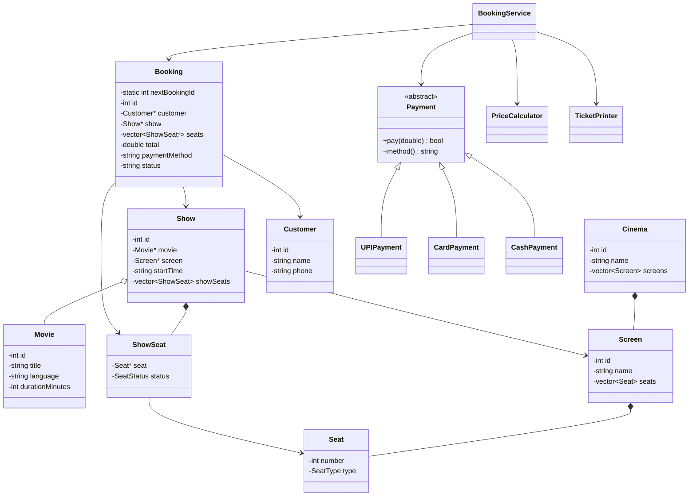

# Class Diagram

## Relationships
- **Composition:** Cinema–Screen, Screen–Seat, Show–ShowSeat.
- **Aggregation:** Show uses a Movie that can exist independently.
- **Association:** Booking is associated with Customer and Show.
- **Runtime polymorphism:** Payment subclasses override `pay()` and `method()`.
- **Compile-time polymorphism:** overloaded Movie constructors and PriceCalculator methods.
