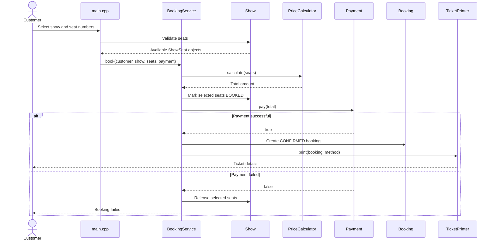
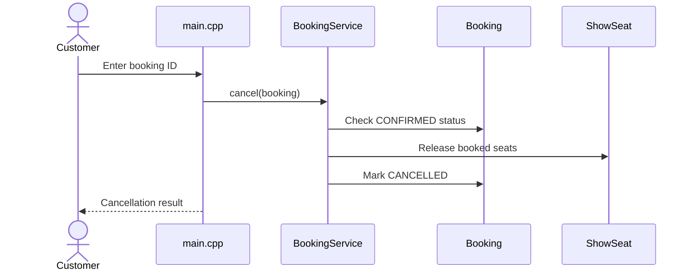

# Booking Sequence Diagram

```mermaid
sequenceDiagram
    actor Customer
    participant UI as main.cpp
    participant Service as BookingService
    participant Show
    participant Price as PriceCalculator
    participant Pay as Payment
    participant Booking
    participant Ticket as TicketPrinter

    Customer->>UI: Select show and seat numbers
    UI->>Show: Validate seats
    Show-->>UI: Available ShowSeat objects
    UI->>Service: book(customer, show, seats, payment)
    Service->>Price: calculate(seats)
    Price-->>Service: Total amount
    Service->>Show: Mark selected seats BOOKED
    Service->>Pay: pay(total)
    alt Payment successful
        Pay-->>Service: true
        Service->>Booking: Create CONFIRMED booking
        Service->>Ticket: print(booking, method)
        Ticket-->>Customer: Ticket details
    else Payment failed
        Pay-->>Service: false
        Service->>Show: Release selected seats
        Service-->>Customer: Booking failed
    end
```

## Cancellation Flow

```mermaid
sequenceDiagram
    actor Customer
    participant UI as main.cpp
    participant Service as BookingService
    participant Booking
    participant ShowSeat

    Customer->>UI: Enter booking ID
    UI->>Service: cancel(booking)
    Service->>Booking: Check CONFIRMED status
    Service->>ShowSeat: Release booked seats
    Service->>Booking: Mark CANCELLED
    UI-->>Customer: Cancellation result
```
